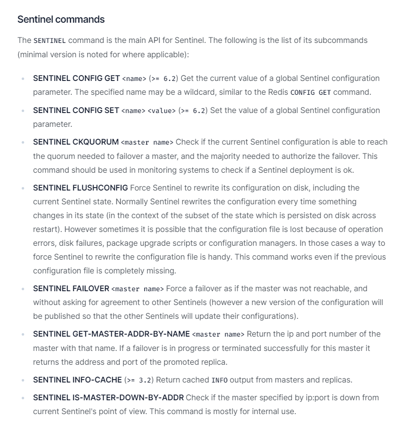
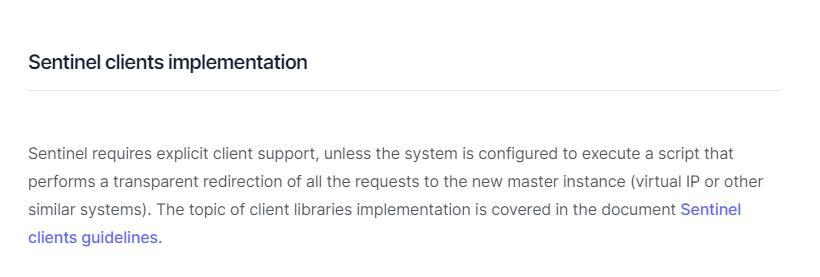

## REDIS SENTINEL

사내 인프라에는 방화벽 규정이 있다. 모든 포트는 닫아두고 사용하는 포트만 열어두는 정책이다. 한번은 REDIS 에 접속해서 PUB SUB 패턴을 사용해서 게임 서버와 의사소통을 하는 일이 필요해졌는 데, 해당 작업을 담당했던 동료가 방화벽을 어떻게 신청해야할지 모르겠다고 물어보더라. SENTINEL 포트와 REDIS 포트 두개를 다 방화벽 오픈 하면 된다고 했더니, SENTINEL 만 오픈하면 되는거 아니냐고 되물어왔다. 이에 대해서 제대로 된 답변을 못했는데, 관련해서 공부를 좀 했다.

너무 당연한 이야기인지 구글링 했을 때에 SENTINEL 과 클라이언트의 연결 메카니즘에 대해서는 딱히 안나오고, 죄다 SENTINEL 의 FAIL OVER 메카니즘에 대한 얘기만 나오더라.

결국 편법은 어려웠고, 정공으로 공식 문서(https://redis.io/docs/management/sentinel/)를 뒤져봤는데,
 SENTINEL 의 명령어 구성을 보다가 '어 아답팅 해주는 데 마스터 IP를 왜 알려주지?' 란 생각이 들더라.    
 
 그래서 이 커맨드를 사용을 언제하는 지를 찾아보면 되겠다 싶어서 문서를 좀 더 살펴봤다. 문서를 더 읽어나가다보니 문서 거의 끝자락에 CLIENT 구현 요구사항에 대한 문서(https://redis.io/docs/reference/sentinel-clients/)가 별첨되어있더라.
 
 

### SENTINEL 에 클라이언트 접속 과정

센티넬 클라이언트 구현 요구사항 문서(https://redis.io/docs/reference/sentinel-clients/) 를 보고 궁금했던 점을 알게 되었다.

아래는 SENTINEL 에 접속하게 되는 클라이언트가 행하는 작업의 흐름이다.

1. 클라이언트가 SENTINEL 에 CONNECTION
2. 클라이언트가 SENTINEL 에 MASTER REDIS 의 IP 정보를 요구.
3. SENTINEL 은 MASTER REDIS IP 와 PORT 정보를 응답
4. 클라이언트는 MASTER REDIS 가 정상인지 확인
5. 클라이언트는 MASTER REDIS 에 CONNECTION

이렇다 보니 클라이언트 입장에서 SENTINEL 방화벽과 REDIS 방화벽을 모두 처리해야한다는 의미가 된다.  여기에서 의미하는 바는 REDIS 와 SENTINEL 을 보통 각각 3개씩 구성하게 되는데, 예를 들면 아래처럼

- SENTINEL a - REDIS a
- SENTINEL b - REDIS b
- SENTINEL c - REDIS c

6개의 물리 호스트에 대한 IP 와 포트 정보를 알아야하고, 방화벽 룰을 6개나 열어야 한다는 말이 된다.

### SENTINEL 과 REDIS 는 동일한 서버에 설치해야하는가?

기본적으로 다른 서버에 설치해야 한다. 이유는 아래와같다.

1. 클라이언트가 SENTINEL 에 CONNECTION
2. 클라이언트가 SENTINEL 에 MASTER REDIS 의 IP 정보를 요구.
3. SENTINEL 은 MASTER REDIS IP 와 PORT 정보를 응답
4. 클라이언트는 MASTER REDIS 가 정상인지 확인
5. 클라이언트는 MASTER REDIS 에 CONNECTION
6. 클라이언트와 MASTER REDIS 가 서로 쿵짝쿵짝
7. MASTER REDIS 사망
8. 클라이언트 커넥션 에러 발생
9. 클라이언트 SENTINEL 에 다시 재접속하여, 다른 MASTER REDIS 가 누구인지 질문
10. SENTINEL : 응답없음 (나도 죽었어)

이런 시나리오가 나올수 있기 때문이다.

### 개요

REDIS MASTER 와 REDIS SLAVE 설정은 REDIS 내에서 설정한다.

SENTINEL 은 모니터링만 한다. MASTER REDIS 가 죽었다고 판단되면 다른 REDIS SLAVE 하나를 slave(readonly)모드를 해제하고 니가 MASTER 가 되라고 귀띰만 해줄 뿐이다.
 
SENTINEL 은 MASTER REDIS 에 1초마다 ping 을 때려서 MASTER REDIS 가 정상인지 체크한다. 응답이 없으면 이 MASTER REDIS 는 죽은 것으로 판단하는 데, 만약 SENTINEL 3대 이상의 병렬 구성 이 되어있다면, 다른 SENTINEL 도 ping 이 제대로 안가는 지 서로 물어본다. 

여기서 특정 SENTINEL 에서만 MASTER REDIS 에 ping 이 되지 않는다면 SDOWN(Subjectively 주관적 다운) 라 하여, 장애 복구를 하지 않는다. SDOWN 이 누적 되어 일정 기준(qurum 합의 카운트) 이상 SENTINEL 들이 SDOWN 보고를 내면 이는  ODOWN(Objectively 객관적 다운) 이라 하여 확실하게 MASTER REDIS 가 셧다운 되었다고 판단한다. 이후 FAIL-OVER 를 수행하게 되고, SLAVE REDIS 에게 readonly 를 해제하고 MASTER 가 되라고 귀띰한다. 쉽게 말해 SDOWN 이 누적되면 ODOWN 이 된다고 보면 된다. 

만약 여기서 MASTER 로 쓸수 없는 SLAVE 가 없다면 (모든 REDIS 가 죽었다면), 다른 MASTER-SLAVE 구성이 있는지 확인하고 다른 MASTER-SLAVE REDIS 그룹에게 같은 절차를 수행한다. 이때에는 최초의 MASTER-SLAVE 그룹의 데이터는 복구 할수 없다. 단순히 서비스 지속성을 유지만 할 뿐이다.

- REDIS 설정에는 REDIS MASTER 와 SLAVE 설정을 한다.
- SENTINEL 설정에는 MASTER-REDIS 그룹들을 설정할 수 있다. 일반적으로 MASTER-REDIS 그룹 1개만 사용하나, 다른 그룹도 사용하기도 한다. MASTER REDIS name 이 그룹의 이름이 된다. MASTER REDIS NAME 이 이래서 중요하다.